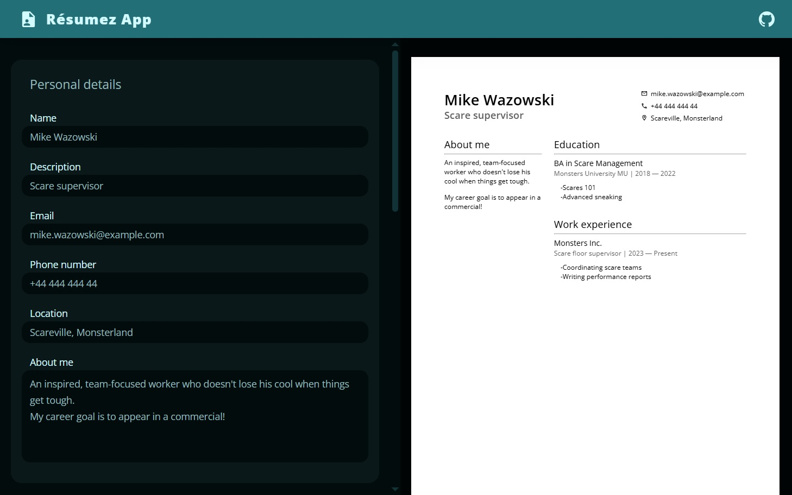

# Résumez App

A web app to create and edit your own résumé. [Check out the site here!](https://reesumez.netlify.app/)

This was an assignment for [The Odin Project](https://www.theodinproject.com/lessons/node-path-react-new-cv-application)'s fullstack javascript webdev course.

## How to use

Enter your info in the inputs and the résumé will update automatically. On mobile, you can switch between editing and previewing the résumé with the arrow at the bottom of the screen.

Under "Education" and "Work experience", you can add extra entries with the "+" button, or delete an entry with the "x" button.

## Planned features

If I can be bothered to keep up development, you can expect these major features:

- Download and print your résumé as a PDF
- Save your data so you can continue editing where you last left off
- Reorder your work/education entries by date.
- Extra layouts so you can customize the look of your résumé
- Add photos to your document
- Extra languages

## Development log

Well, there it is! Honestly, even though it took longer than any previous project (>2 weeks!), time really flew by. I think it's because I'm getting better at modular design, and that makes problems seem a lot more approachable. Also, having a design system with variables made the UI _waay_ less painful to implement. Huge thanks to [Sajid on YouTube](https://www.youtube.com/@whosajid), his videos finally unlocked design systems for me.

The point of this assignment was to get my feet wet with react's state functionality, and I found it reasonably easy to use. Well, even if my solution was a little hacky (With so many inputs, I ended up using multiple forms to keep the central state both flat, and extendable). I really like how I can use jsx to crank out components quickly, and sprinkle in some vanilla js here and there to get fine-grained control over certain elements.

Another thing that made development easier was my yarn + react template (currently private). It took a whole day to write, but applying it to this project was totally seamless. I didn't have to fiddle with yarn's rough edges, and the boilerplate generated by vite was already minimised

This was also my first deployment using Netlify instead of Github pages. Not much to report there; I was hoping to learn a bit about CI by trying out a different service, but Netlify's CI automation is so painless that I didn't really learn anything lol. Maybe I'll switch back to github pages and replace my hacky dist script with a workflow. Or maybe I'll try Vercel or Cloudflare, see if they're better for learning the ropes.

To cap this devlog off, I wanna say that this was a fun project to work on! I'd love to keep adding features, but maybe it's time to move on. I think I'll show the app to my friends and implement some of their input. If they show interest, _maaaybe_ I'll actually add the extra features I had planned. Maybe.
